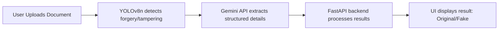

# 🔐 AuthenTech – AI-Powered Document Verification & Authentication Platform

  

 **Tagline:** *“Trust Made Digital”*  

AuthenTech is an **AI-powered platform** that enables **real-time document verification and authentication**.  
By combining **computer vision (YOLOv8n)** with **OCR (Gemini API)**, AuthenTech detects forgeries, extracts structured data,  
and ensures that every certificate, credential, or official paper can be instantly and reliably validated.  

Built during **HackOdisha 2025**, AuthenTech solves the problem of **fake documents, slow manual verification, and lack of scalable solutions**.  

---

## 🚨 Problem Statement  
- 📄 Increasing number of **fake/forged certificates** in jobs, education, and governance.  
- ⏳ Manual verification is **slow, error-prone, and resource-intensive**.  
- 🚫 No scalable, automated solutions exist for **bulk verification**.  
- ⚠️ Fraudulent activities **erode trust** and cause financial/reputational damage.  

---

## ✅ Our Solution: AuthenTech  
AuthenTech provides a **robust, AI-driven platform** for instant and reliable verification.  

✔ Upload any certificate/document.  
✔ Detect forged/tampered regions using **YOLOv8n**.  
✔ Extract structured details with **Gemini API OCR** (Name, Roll No, Course, CGPA, etc.).  
✔ Get a **clear authenticity status**: ✅ *Original* or ❌ *Fake*.  

---

## 🌟 Key Features & USP  
- 🔒 **AI + OCR Integration** – One platform for detection + extraction.  
- ⚡ **Real-Time Verification** – Instant results with high accuracy.  
- 🌐 **Scalable** – Handles individuals, institutions, and bulk checks.  
- 🎯 **User-Friendly UI** – Simple upload → instant output.  

**MVP Features:**  
1. Upload Document  
2. Detect Forgery  
3. Extract Data  
4. Display Authenticity  

---

## ⚙️ Workflow  

## 🎬 Live Prediction Instances  

Our system predicts document authenticity in a **smooth, user-friendly way** directly from the live website.  

There are **3 possible outcomes**:  

1. 🟥 **Fake Document Detected**  
   The system flags manipulated or tampered documents.  
   - *Example Screenshot:*
     
    
 

2. 🟩 **Original Document Detected**  
   The system verifies and validates genuine documents.  
   - *Example Screenshot:*
      

 
     

3. 🟨 **Invalid Document Format**  
   If the uploaded file is not a valid certificate/document, the system detects and alerts the user.  
   - *Example Screenshot:*  

   

     

## 🌐 Website Snapshots  

Here are some snapshots of the **AuthenTech web platform**:  

